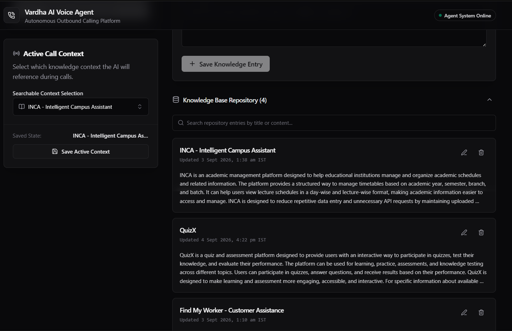
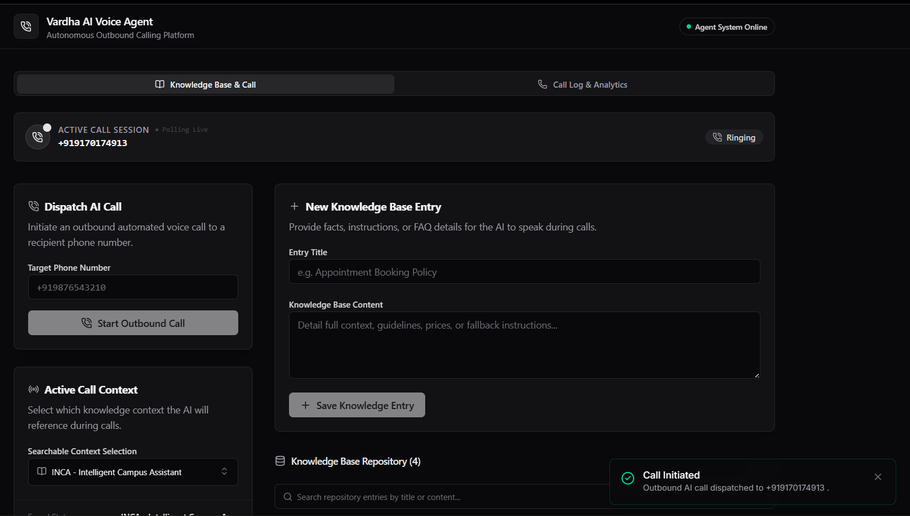
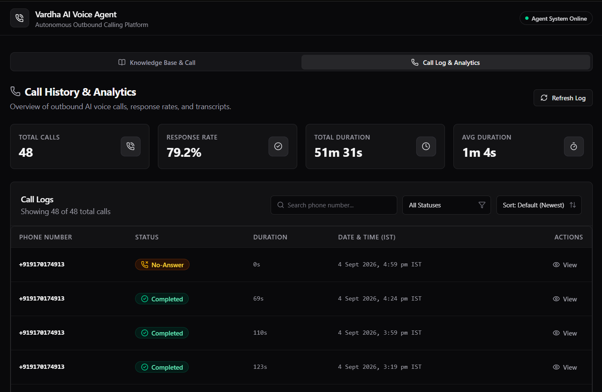
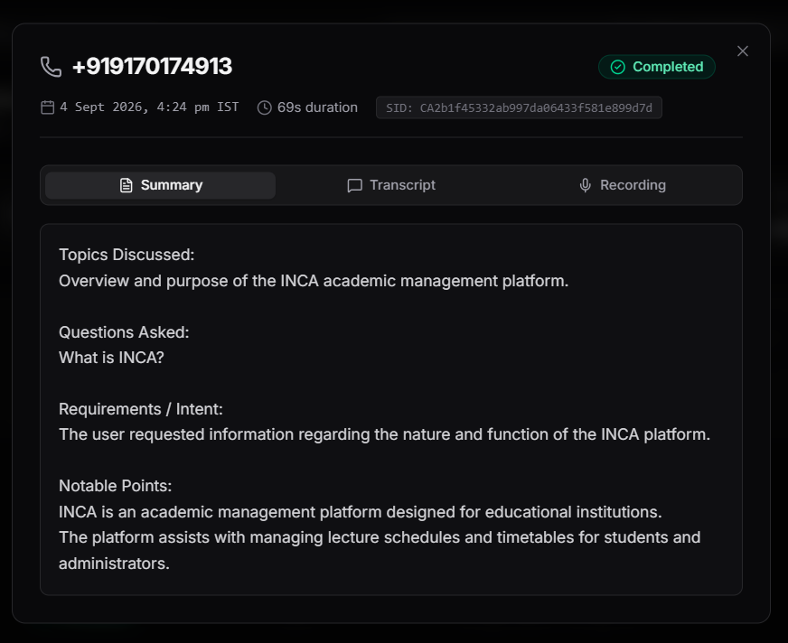
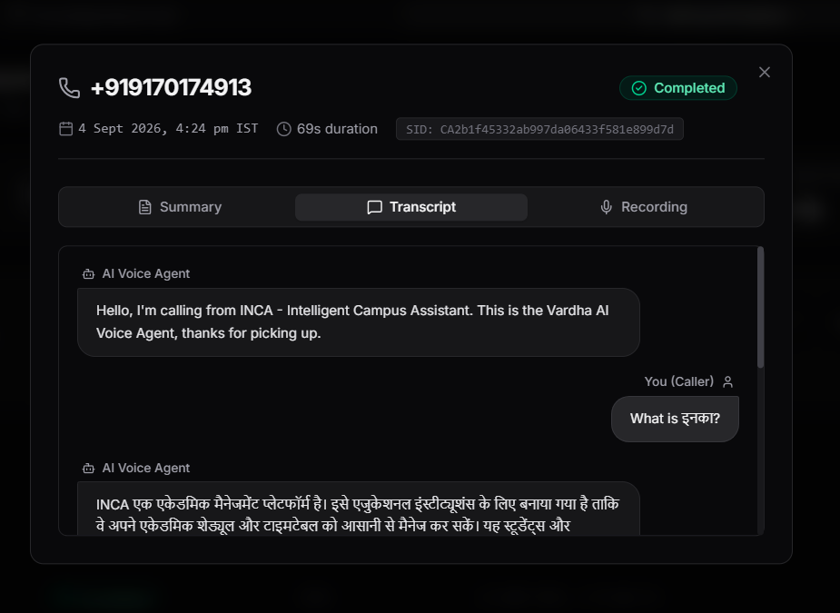
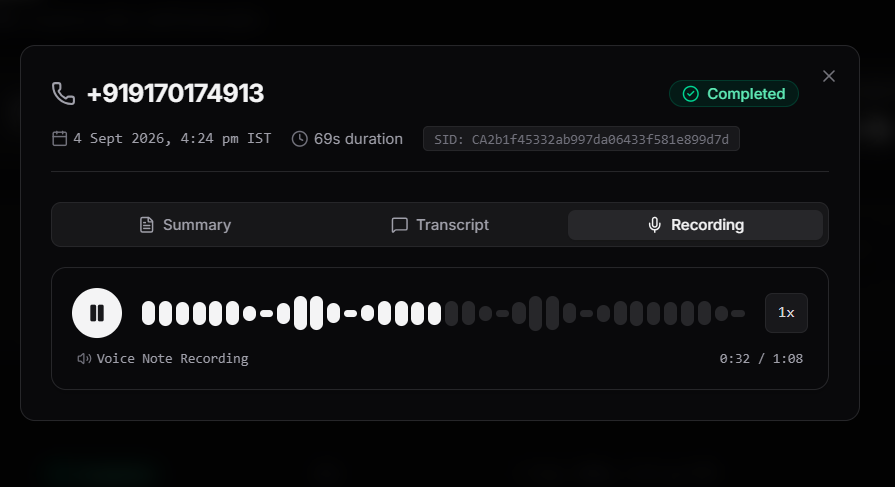
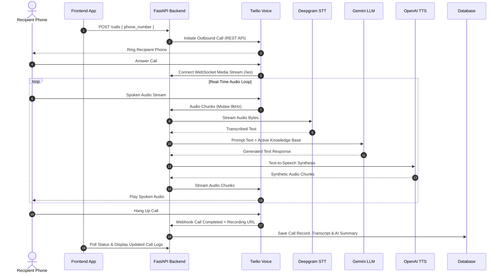

# Vardha AI Voice Calling Agent

> Autonomous outbound calling platform that conducts real-time, Knowledge Base–grounded voice conversations, records calls, and automatically generates chat transcripts and AI summaries.

[](https://www.python.org/)
[](https://fastapi.tiangolo.com/)
[](https://react.dev/)
[](https://www.typescriptlang.org/)
[](https://tailwindcss.com/)
[](https://www.twilio.com/)

---

> 🔗 **Live App:** [https://vardha-links-voice-calling-agent.vercel.app](https://vardha-links-voice-calling-agent.vercel.app)

> 📹 **Demo Video:** [Watch the demo video]([DEMO_VIDEO_LINK_HERE](https://youtu.be/yVIfLpLRI9Q))

---

## Overview

The **Vardha AI Voice Calling Agent** is a full-stack platform designed to automate outbound voice communication. It enables businesses to trigger automated calls to recipient mobile numbers, where an AI agent engages in a natural, low-latency spoken dialogue grounded strictly in custom Knowledge Base documentation.

Following every call, the system captures full audio recordings, parses raw speech into structured chat transcripts, and generates concise executive summaries. A clean, dark-monochrome dashboard provides real-time call tracking, composable analytics, and instant audio playback.

---

## Features

- **Knowledge Base Management & Context Selection**:
  - Full CRUD repository for knowledge entries (create, edit, delete with modal confirmation, and collapse/expand view).
  - Client-side title and content search across the repository.
  - Searchable Combobox dropdown to lock active Knowledge Base context for outbound calls.

- **Outbound AI Calling & Real-Time Voice Streaming**:
  - One-click outbound call dispatching to recipient phone numbers.
  - Bi-directional WebSocket media streaming via Twilio Voice.
  - Sub-second conversational responses powered by Deepgram STT, Google Gemini LLM, and OpenAI TTS.

- **Live Call Status Tracking & Lifecycle Toasts**:
  - Real-time polling banner tracking active call state (*Initiated*, *In Progress / Live*, *Disconnected*).
  - Single-fire toast notifications for call disconnection, transcript generation, and summary saving.

- **WhatsApp-Style Voice Note Player**:
  - Custom HTML5 waveform audio player with 36 interactive amplitude bars.
  - Container click and drag-to-seek, accurate duration calculation workaround for streamed media, and speed controls (`1x` / `1.5x` / `2x`).

- **Chat-Style Transcript & Clean Summaries**:
  - iMessage/WhatsApp-style left/right chat bubble transcript UI for User and AI speaker turns.
  - Client-side regex markdown cleaner stripping legacy formatting artifacts from summaries.

- **Dashboard Analytics & Composable Filters**:
  - Glanceable metric cards: *Total Calls*, *Response Rate (%)*, *Total Duration*, and *Average Call Duration*.
  - Full India Standard Time (**Asia/Kolkata**) formatting across all timestamps (`4 Sep 2026, 4:24 PM IST`).
  - Multi-filter composition combining phone search, status filtering, and duration sorting.

---

## Screenshots

### Knowledge Base Management


### Placing a Call


### Call History Dashboard


### Call Detail — Summary


### Call Detail — Transcript


### Call Detail — Recording


---

## Architecture

### Data & Real-Time Audio Flow



---

## Tech Stack

| Layer | Technology | Purpose |
|---|---|---|
| **Frontend Framework** | React 19 + TypeScript | UI state management & component hierarchy |
| **Styling & UI Components** | Tailwind CSS v4 + Radix UI + shadcn/ui | Dark monochrome design system & accessible primitives |
| **Icons** | Lucide Icons | Visual status indicators and interface icons |
| **Build System** | Vite 8 + TypeScript Compiler (`tsc`) | Fast HMR development and production bundling |
| **Backend Framework** | FastAPI (Python 3.10+) | Async REST API & WebSocket media streaming server |
| **Database** | PostgreSQL / SQLAlchemy | Persistent storage for Knowledge Base & Call History |
| **Telephony** | Twilio Voice API | Outbound call dispatching & WebSocket TwiML streams |
| **Speech-to-Text (STT)** | Deepgram Nova-2 | High-speed real-time speech transcription |
| **Conversational LLM** | Google Gemini 1.5 Flash | Grounded conversation reasoning & summary generation |
| **Text-to-Speech (TTS)** | OpenAI Audio TTS | Low-latency natural voice synthesis |

---

## Project Structure

```
ai-voice-calling-agent/
├── backend/              # FastAPI application server, database models & AI services
│   ├── app/              # Main application package (routes, services, models, schemas)
│   ├── requirements.txt  # Backend Python dependencies
│   └── .env.example      # Environment variable template for backend
├── frontend/             # React + Vite application with Tailwind CSS & shadcn/ui
│   ├── src/              # Application components, UI primitives, hooks & utilities
│   ├── package.json      # Frontend Node.js dependencies & scripts
│   └── .env.example      # Environment variable template for frontend
├── docs/                 # Documentation assets & screenshots
│   └── screenshots/      # Interface preview screenshots
└── README.md             # Project documentation & setup guide
```

---

## Getting Started

### Prerequisites

- **Node.js**: `v18.0.0` or higher
- **Python**: `v3.10.0` or higher
- **Ngrok**: Installed locally for tunneling Twilio webhooks during development
- **PostgreSQL** or **SQLite**: Database instance

---

### Environment Variables

#### Backend Environment Variables (`backend/.env`)

| Variable | Description | Required |
|---|---|---|
| `DATABASE_URL` | PostgreSQL or SQLite connection string | **Y** |
| `TWILIO_ACCOUNT_SID` | Twilio Account SID identifier | **Y** |
| `TWILIO_AUTH_TOKEN` | Twilio Auth Token credential | **Y** |
| `TWILIO_PHONE_NUMBER` | Twilio purchased outbound phone number (E.164 format) | **Y** |
| `PUBLIC_BASE_URL` | Public HTTPS/WSS URL (e.g. Ngrok tunnel URL) for Twilio webhooks | **Y** |
| `DEEPGRAM_API_KEY` | Deepgram API key for real-time speech-to-text | **Y** |
| `GEMINI_API_KEY` | Google Gemini API key for conversation reasoning | **Y** |
| `OPENAI_API_KEY_VARDHA` | OpenAI API key for text-to-speech audio synthesis | **Y** |

#### Frontend Environment Variables (`frontend/.env`)

| Variable | Description | Required |
|---|---|---|
| `VITE_API_URL` | Base URL of the running FastAPI backend server | **Y** |

---

### Installation & Setup

#### 1. Backend Setup

```bash
# Navigate to backend directory
cd backend

# Create a virtual environment
python -m venv .venv

# Activate virtual environment
# Windows:
.venv\Scripts\activate
# macOS/Linux:
source .venv/bin/activate

# Install dependencies
pip install -r requirements.txt

# Create environment configuration file
cp .env.example .env
```

*(Edit `backend/.env` with your database URL and API keys).*

#### 2. Frontend Setup

```bash
# Navigate to frontend directory
cd frontend

# Install Node modules
npm install

# Create environment configuration file
cp .env.example .env
```

*(Edit `frontend/.env` to set `VITE_API_URL=http://localhost:8000`).*

---

### Running Locally

1. **Start the FastAPI Backend**:
   ```bash
   cd backend
   uvicorn app.main:app --reload --port 8000
   ```

2. **Expose Local Backend to Twilio via Ngrok**:
   ```bash
   ngrok http 8000
   ```
   *Copy the generated HTTPS URL (e.g. `https://abc123.ngrok-free.app`) and paste it as `PUBLIC_BASE_URL` in `backend/.env`.*

3. **Start the Frontend Development Server**:
   ```bash
   cd frontend
   npm run dev
   ```
   *Open `http://localhost:5173` in your browser.*

---

## Usage Walkthrough

1. **Knowledge Base Configuration**:
   - Navigate to the **Knowledge Base & Call** tab.
   - Add a new Knowledge Base entry (e.g., Title: *"Appointment Policies"*, Content: *"Appointments can be booked Monday through Friday..."*).
   - Use the **Active Call Context** combobox to select your active knowledge base or choose *"All Knowledge Bases"*, then click **Save Active Context**.

2. **Dispatch an Outbound Call**:
   - Enter a valid recipient phone number in E.164 format (e.g. `+919876543210`) under **Dispatch AI Call**.
   - Click **Start Outbound Call**. The AI agent will dial the number and engage in a live voice conversation once answered.

3. **Live Call Monitoring**:
   - Observe the **Active Call Session** banner polling live status. Receives automatic toast notifications when the call disconnects and transcript/summary are saved.

4. **Review Analytics & Call Detail Modal**:
   - Switch to the **Call Log & Analytics** tab.
   - Inspect top metric cards (*Total Calls*, *Response Rate*, *Total Duration*).
   - Use the phone search bar, status dropdown, or duration sort to filter calls.
   - Click **View** on any call row to open the modal:
     - **Summary Tab**: Read cleaned executive summary.
     - **Transcript Tab**: View WhatsApp-style speaker chat bubbles.
     - **Recording Tab**: Play audio recording with the custom waveform player and speed controls (`1x` / `1.5x` / `2x`).

---

## Known Limitations

- **Single Active Context**: Calls currently reference either a single selected Knowledge Base entry or all entries combined, rather than dynamic multi-tag routing.
- **Telephony Dependency**: Local execution requires active API keys for Twilio, Deepgram, Gemini, and OpenAI, alongside an active Ngrok tunnel for webhook ingress.
- **Language Support**: AI prompt templates are optimized primarily for English, Hindi, and Hinglish dialogue interactions.

---

## License & Repository Info

- **Repository**: [https://github.com/exceptional007/Vardha-Links-Voice-Calling-Agent](https://github.com/exceptional007/Vardha-Links-Voice-Calling-Agent)
- **Deployed App**: [https://vardha-links-voice-calling-agent.vercel.app](https://vardha-links-voice-calling-agent.vercel.app)
- **Author**: Akshhat Srivastava

---
